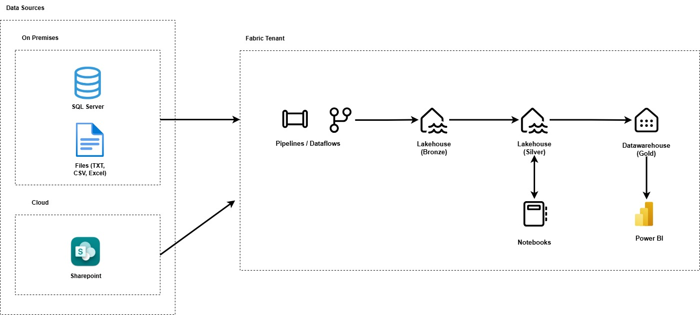
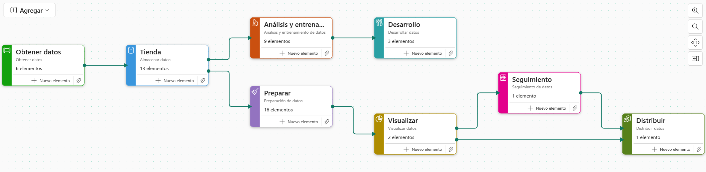

# 🖥 Arquitectura del Proyecto

Este proyecto sigue el enfoque **Medallion Architecture**, ampliamente utilizado en entornos analíticos modernos.  
El objetivo es garantizar **gobernanza, calidad, escalabilidad y trazabilidad de datos** a lo largo de todo el flujo analítico.

---

## 📐 Diagrama General

---

## 🏗 **Capas de la Arquitectura**

### 1️⃣ **Capa Bronze (Datos Crudos)**
- **Recurso de almacenamiento:**  
  Lakehouse "lakehouseBronze".
- **Propósito:**  
  Almacenar los datos tal como provienen de los orígenes (SQL Server, SharePoint, etc.), sin aplicar transformaciones.  
- **Características:**
  - Contiene **datos en su forma original**, con mínima manipulación (movimiento desde seccion Files a Tablas).
  - Sirve como **punto de trazabilidad** en caso de auditoría.
  - Soporta múltiples formatos: **Parquet, CSV, JSON**.
- **Ejemplos en el proyecto:**
  - Tablas sin procesar provenientes del ERP (SQL Server).
  - Archivos cargados desde SharePoint.

---

### 2️⃣ **Capa Silver (Datos Limpios y Estandarizados)**
- **Recurso de almacenamiento:**  
  Lakehouse "lakehouseSilver".
- **Propósito:**  
  Aplicar **transformaciones**, **limpieza** y **enriquecimiento** de datos.  
  Es donde se asegura la **calidad de la información**.
- **Características:**
  - Se eliminan inconsistencias y duplicados.
  - Se aplican **reglas de negocio iniciales**.
  - Normalización de formatos (fechas, claves, nombres).
- **Tareas clave en el proyecto:**
  - Conversión de campos calculados.
  - Inclusión de **claves sustitutas (SK)** para futuras dimensiones.
  - Preparación de datasets para análisis exploratorio (EDA) y modelado predictivo.

---

### 3️⃣ **Capa Gold (Modelado Semántico y Consumo)**
- **Recurso de almacenamiento:**  
  Warehouse "warehouseGold".
- **Propósito:**  
  Construir un modelo de datos **optimizado para analítica** y **dashboards en Power BI**.
- **Características:**
  - Se crean **dimensiones y hechos** bajo un enfoque de **Data Warehouse**.
  - Se implementa el modelo **estrella (Star Schema)** para consultas rápidas.
  - Incluye métricas calculadas y columnas derivadas listas para consumo.
- **Tareas clave en el proyecto:**
  - Integración en el **Warehouse de Fabric**.
  - Generación de KPIs y tablas resumen.
  - Base para **informes Power BI** y **modelos ML**.

---

# 🔄 Flujo de Tareas en Microsoft Fabric

El proyecto sigue un flujo orquestado en Microsoft Fabric que garantiza la trazabilidad y control en cada etapa.  
La siguiente imagen representa los **bloques funcionales del pipeline end-to-end**:

---

## 🧩 Elementos del Flujo y su Función

### **1. Obtener datos**
Responsable de **extraer información desde las fuentes originales** hacia la capa **Bronze (lakehouseBronze)**.

- **dataflowCanal** → Orquesta datos de los canales de distribución desde **SharePoint** a **Bronze**.
- **dataflowIndustria** → Orquesta datos de clasificación por industria desde **SharePoint** a **Bronze**.
- **dataflowSegmentoComercial** → Orquesta datos de clasificación por segmento comercial desde **SharePoint** a **Bronze**.
- **dataflowValorEstrategico** → Orquesta datos según valor estratégico desde **SharePoint** a **Bronze**.
- **notebookClientesBronze** → Carga datos de clientes desde archivos en **Bronze** a tablas del mismo lakehouse.
- **pipelineTablas** → Orquesta contratos y tablas relacionadas desde **SQL Server** hacia **Bronze**.

---

### **2. Tienda**
Es la **capa de almacenamiento organizada en el Lakehouse y Warehouse**, dividida en niveles:

- **lakehouseBronze** → Datos tal cual provienen de los orígenes (sin limpieza).
- **lakehouseSilver** → Datos limpios, transformados, con reglas de negocio aplicadas. Punto de partida para Data Science.
- **warehouseGold** → Datos listos para análisis en Power BI bajo esquema **estrella**.

---

### **3. Preparar**
Incluye procesos de **transformación, estandarización y modelado** desde Bronze → Silver → Gold.

- **Dataflows:**
  - **dataflowClasificaciones** → Tablas relacionadas a clasificaciones de clientes (Bronze → Silver).
  - **dataflowClientes** → Datos de clientes (Bronze → Silver).
  - **dataflowProject** → Datos de contratos (Bronze → Silver).
  - **dataflowDimClientes**, **dataflowDimEjeGrupo**, **dataflowDimClasificaciones**, **dataflowPredictions** → Cargas hacia Gold.

- **Notebooks:**
  - **notebookMoneda** → Creación de tabla de monedas en Bronze.
  - **notebookEjecutivoGrupoActivo**, **notebookEjecutivoGrupoSilver**, **notebookActivoSilver**, **notebookCategoriaSilver**, **notebookClasificaciones**, **notebookClientesSilver** → Transformaciones y llaves subrogantes (SK) en Silver.
  - **notebookFactContratosSilver** → Llaves subrogantes en tabla de contratos.

---

### **4. Análisis y entrenamiento**
Uso de **Azure ML y notebooks en Fabric** para crear y entrenar modelos predictivos:

- **ML_Churn**, **ML_Contratos_Churn** → Experimentos en Azure ML.
- **notebookChurnContratos**, **notebookChurnTraining**, **notebookClusteringTraining** → Entrenamiento de modelos de churn y segmentación.
- **notebookEDA** → Análisis exploratorio (EDA).
- **pipelinesDatasets** → Generación de datasets para modelos.

---

### **5. Desarrollo**
Enfocado en el **scoring y evaluación de modelos**:

- **notebookChurnScoring** → Scoring del modelo churn.
- **notebookClusteringScoring** → Scoring del modelo de clustering.
- **notebookClusterAvg** → Análisis estadístico de clústeres.

---

### **6. Visualizar**
Modelos y dashboards listos para análisis en **Power BI**:

- **proyectoContratos** → Informe descriptivo + predictivo.
- **proyectoContratos (Modelo semántico)** → Modelo semántico del informe.

---

### **7. Seguimiento**
Monitoreo y alertas:

- **activatorMontoCompraFinal** → Activador para monitorear el monto final de contratos.

---

### **8. Distribuir**
Publicación y acceso a usuarios:

- **nkContratos** → Aplicación que distribuye el informe de contratos.

---

## ✅ Beneficios del flujo
- **Organización clara por fases.**
- **Trazabilidad completa** de datos y modelos.
- **Escalabilidad** para agregar nuevas fuentes, reglas y modelos.

---

## ✅ Beneficios del Enfoque Medallón
- **Escalabilidad:** Permite incorporar más orígenes sin romper el flujo.
- **Gobernanza:** Cada capa sirve como punto de control.
- **Flexibilidad:** Facilita análisis exploratorios, BI y Machine Learning desde una misma base confiable.
