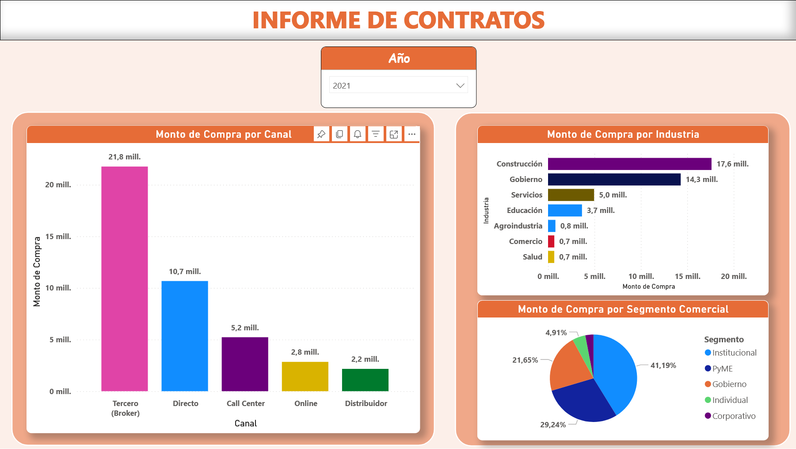
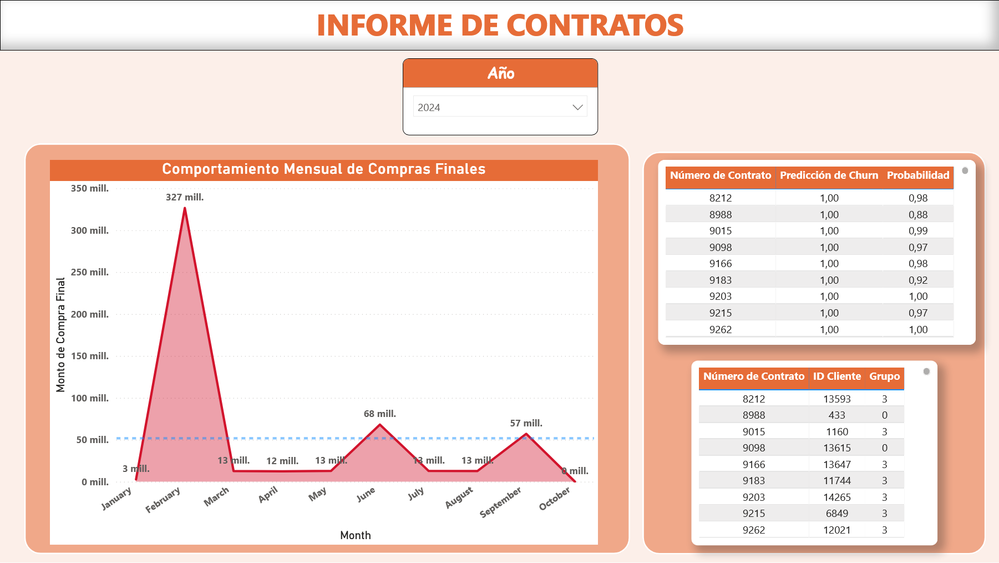

# 📊 Dashboards y Medidas en Power BI

Este proyecto incluye un informe analítico llamado **Informe de Contratos**, desarrollado en **Power BI**, conectado dinámicamente mediante **DirectLake** al **modelo semántico creado en Power BI Service** desde el **Warehouse (capa Gold)**.

---

## 🔗 Conexión Dinámica con DirectLake

- **Modo de conexión:** **DirectLake**
  - Ventajas:
    - Lectura en tiempo real desde el **Lakehouse/Warehouse** sin duplicar datos.
    - Rendimiento optimizado gracias al formato **Delta Lake**.
  - **Arquitectura:**
    - Warehouse (Gold) → Modelo Semántico en Power BI Service → Informe Power BI Desktop.

- **Modelo Semántico:**
  - Diseñado directamente en **Power BI Service**.
  - Basado en el **esquema copo de nieve** generado en el Warehouse.
  - Incluye:
    - Dimensiones: Clientes, Contratos, Clasificaciones, Activos.
    - Hechos: Ventas, Contratos.
    - KPIs para predicciones y comportamiento histórico.

---

## 🗂 Páginas del Informe

El informe está compuesto por **2 páginas principales**, orientadas a análisis **descriptivo y predictivo**:

---

### **📄 Página 1: Análisis de Contratos**


**Elementos clave:**
- **Gráfico de Barras:** *Monto de Compra por Canal*  
- **Gráfico de Barras Horizontal:** *Monto de Compra por Industria*  
- **Gráfico de Pastel:** *Monto de Compra por Segmento Comercial*  
- **Filtro:** *Selección dinámica por Año*  

**Objetivo:**  
Analizar la distribución del monto de compra en diferentes dimensiones (Canal, Industria, Segmento).

---

### **📄 Página 2: Predicciones y Seguimiento**


**Elementos clave:**
- **Gráfico de Área:** *Comportamiento Mensual de Compras Finales*  
- **Tabla 1:** Predicción de Churn por contrato:
  - Número de Contrato
  - Predicción (0/1)
  - Probabilidad
- **Tabla 2:** Identificación de clientes con riesgo de cancelación:
  - Número de Contrato
  - ID Cliente
  - Grupo (cluster asignado)

**Objetivo:**  
Integrar análisis descriptivo con resultados predictivos para decisiones estratégicas.

---

## ✅ Medidas y KPIs principales (DAX)

Ejemplos implementados en el modelo:

```DAX
-- Ventas totales
MontoCompra = SUM('FactContratos'[MontoCompra])

-- Churn Rate
ChurnRate = 
DIVIDE(
    CALCULATE(COUNTROWS('FactContratos'); 'FactContratos'[PrediccionChurn] = 1);
    COUNTROWS('FactContratos');
    0
)

-- Monto acumulado por mes
MontoYTD = 
CALCULATE(
    SUM('FactContratos'[MontoCompra]);
    DATESYTD('DimFecha'[Fecha])
)

